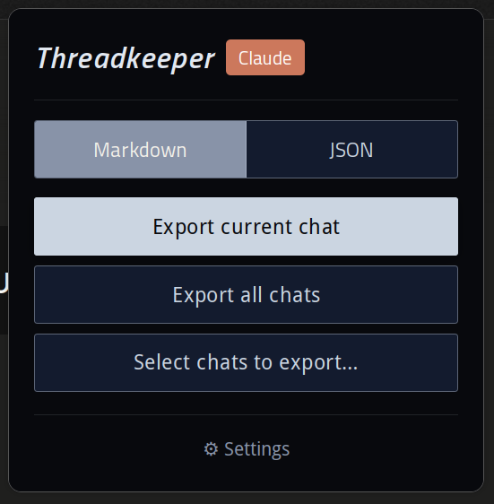
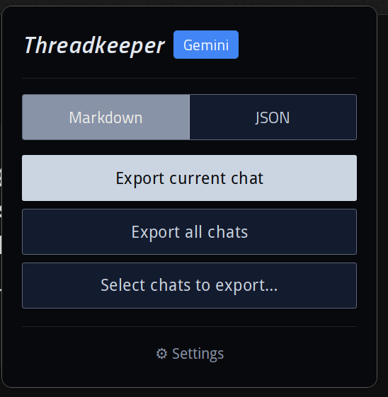
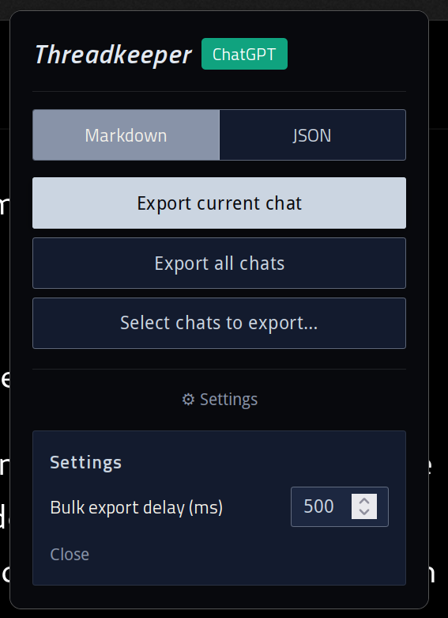
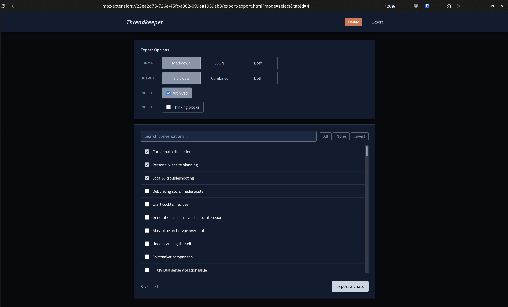
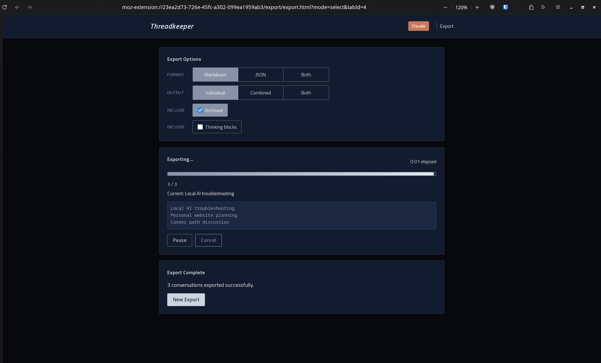

# Threadkeeper

Export your AI chat conversations to Markdown or JSON. Your data, your disk, your archive.

A Firefox browser extension (Manifest V3, with a Chrome port planned) that exports conversations from ChatGPT, Claude.ai, and Google Gemini to local Markdown or JSON files. No accounts, no servers, no API keys — everything runs in the browser against the sites you're already logged into.

If you find Threadkeeper useful and would like to support me: 

  

## Status

Threadkeeper currently runs on Firefox, exporting conversations from ChatGPT, Claude.ai, and Google Gemini to local Markdown or JSON files. Chrome port, packaged builds, and extension-store submission are planned next.

## Features

- **Three platforms:** ChatGPT, Claude.ai, Google Gemini
- **Export modes:** single conversation, bulk (all), or selective (pick from a searchable checklist)
- **Output formats:** Markdown (primary, drops cleanly into Obsidian and other notes apps) and JSON (raw structured backup), individually or combined
- **Preserves** code blocks, conversation structure, and message ordering
- **Claude.ai extras:** optional extended-thinking blocks; artifacts rendered inline
- **Local-only:** no network calls beyond the AI sites themselves; no analytics, no telemetry

  
  
  

## Installation

Threadkeeper is not yet on extension stores. For now, install it as a temporary Firefox add-on:

1. Clone or download this repo.
2. Open Firefox and navigate to `about:debugging#/runtime/this-firefox`.
3. Click **Load Temporary Add-on** and select the `manifest.json` file from the repo root.

The add-on will remain active until Firefox closes. Permanent install via Mozilla Add-ons (and Chrome Web Store, after the Chrome port lands) is planned.

## Usage

Click the Threadkeeper toolbar icon while on a supported site. For single-chat export, pick your format and click Export. For bulk or selective export, choose your mode from the popup — an export page opens with a searchable conversation list, format and output options, and progress tracking.

  

Exports run with progress tracking and a per-conversation log. You can pause, cancel, or kick off a new export from the completion screen.

  

## How it works

Each supported site implements a common three-function interface: list conversations, load a conversation, and parse its messages. Adding a platform means implementing that triad without touching the formatters or background script. ChatGPT and Claude.ai use their internal JSON APIs via cookie-based auth — no DOM scraping required. Gemini uses DOM extraction with a three-technique lazy-load strategy to capture long conversations. A background script owns downloads and orchestration; content scripts never navigate or download directly. Normalized message data flows into pure-function Markdown and JSON formatters that are completely site-agnostic.

## Privacy

All processing happens locally in your browser. Host permissions are scoped to exactly the three target domains (`chatgpt.com`, `claude.ai`, `gemini.google.com`) and nothing else. Threadkeeper makes no network requests of its own — it talks only to the AI sites you're already using, to read your conversations. Exported files are saved directly to your computer's Downloads folder. Nothing is ever transmitted to any third party, and there are no analytics or telemetry of any kind.

## Known limitations

### Gemini conversation dates

Gemini does not expose conversation timestamps in its sidebar DOM, and Threadkeeper does not currently make additional requests to fetch them per-conversation. As a result, Gemini conversations appear in the export list without creation dates, and are shown in the order they appear in Gemini's sidebar rather than sorted by recency. ChatGPT and Claude.ai conversations show dates and are sorted by creation date (newest first).

### Conversations from deleted Gems

If you previously created a Gem (custom Gemini persona) and later deleted it, conversations you had with that Gem become "orphaned" — they remain in Gemini's search but lose their title-rendering context. Threadkeeper will export their content correctly, but uses the first user message as the filename instead of a proper title.

## Acknowledgments

ChatGPT export support adapts API and authentication patterns from [chatgpt-exporter](https://github.com/pionxzh/chatgpt-exporter) by Pionxzh (MIT). Claude.ai export support adapts patterns from [claude-exporter](https://github.com/agoramachina/claude-exporter) by agoramachina and [Claude-Conversation-Exporter](https://github.com/socketteer/Claude-Conversation-Exporter) by socketteer (both MIT). See [ACKNOWLEDGMENTS.md](ACKNOWLEDGMENTS.md) for details.

## License

Licensed under AGPL-3.0-or-later. See [LICENSE](LICENSE).
